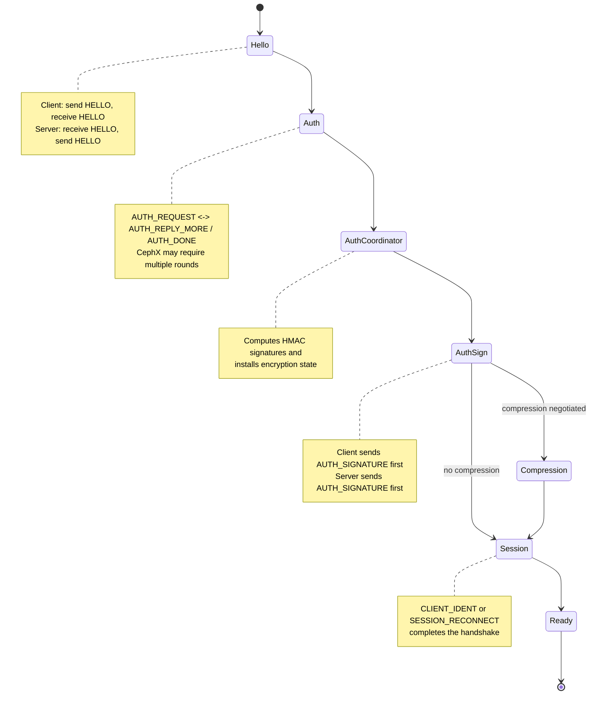
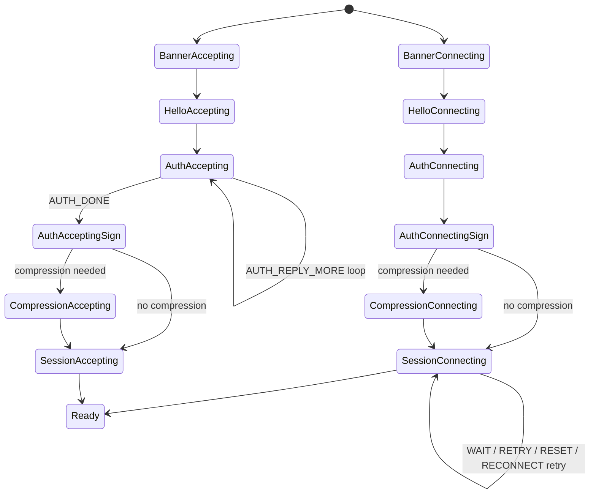
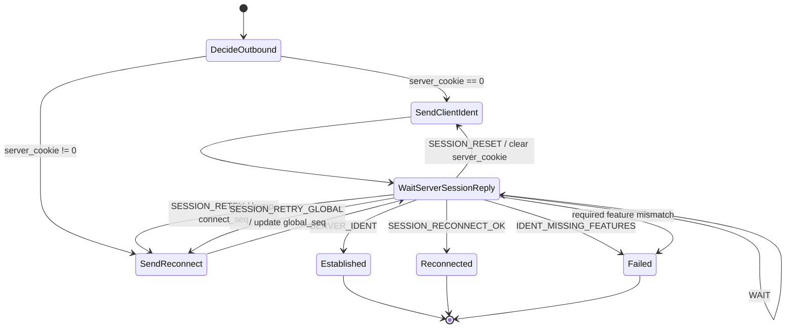
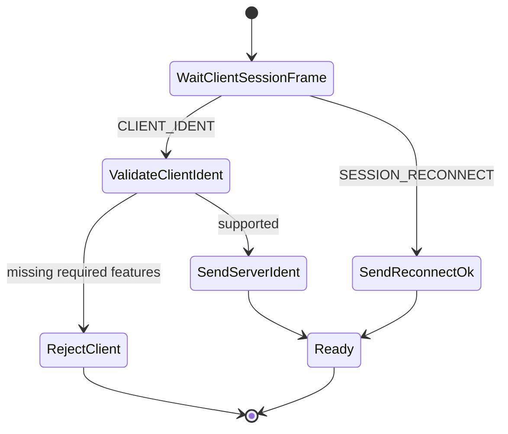
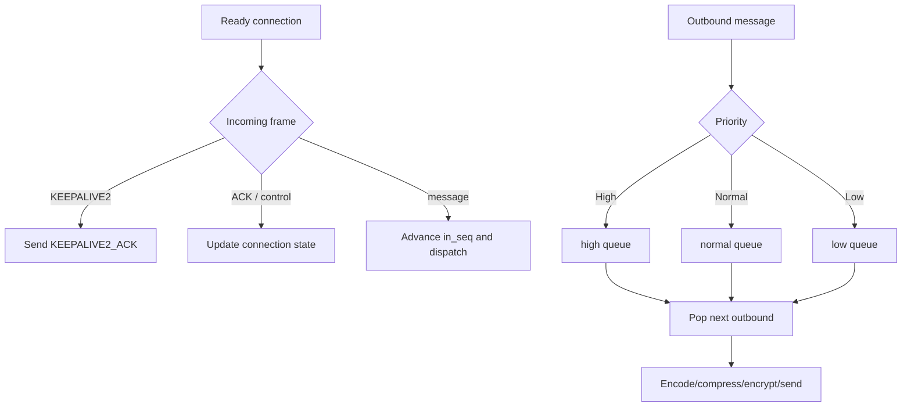

# msgr2 - Ceph Messenger v2 Protocol Implementation

This crate implements the Ceph messenger v2 protocol in Rust.

## State machine overview

The implementation has two closely related state-machine layers:

- `protocol.rs` drives the high-level async handshake as a sequence of pure phases.
- `state_machine.rs` contains the lower-level protocol states that own the wire-level transitions and side effects.

The diagrams below mirror the current implementation closely enough to use as a navigation aid when reading the code.

### Handshake phases driven by `protocol.rs`



### Lower-level protocol states in `state_machine.rs`



### Session sub-state machine

This is the part that decides whether a connection becomes a fresh session, a resumed session, or must retry/reset first.



### Server-side accept path for the session phase



### Runtime behavior after `Ready`

Once the handshake finishes, the connection switches to framed message exchange:

- incoming keepalives are answered with `KEEPALIVE2_ACK`,
- message ordering is tracked with `in_seq` / `out_seq`,
- sent messages are retained for replay across reconnects,
- outbound messages are scheduled through a three-lane priority queue: `high`, `normal`, then `low`.



## Testing

### Unit Tests

Run the standard unit tests with:

```bash
cargo test --lib
```

### Integration Tests

The integration tests in `tests/connection_tests.rs` require a running Ceph cluster. **These tests will fail if the prerequisites are not met.**

#### Prerequisites

1. A running Ceph cluster (local or remote)
2. The `CEPH_CONF` environment variable set to the path of the ceph.conf file

#### Running Integration Tests

```bash
# Set the ceph config path
export CEPH_CONF=/path/to/ceph.conf

# Run the integration tests
cargo test --test connection_tests -- --nocapture
```

#### Configuration

The integration tests will load configuration from the ceph.conf file specified by `CEPH_CONF`. The configuration file should include:
- Monitor addresses in the `mon host` option
- Keyring path in the `keyring` option (or it will use the default path)

## CI/CD

**Important**: The integration tests require a running Ceph cluster and will fail in CI if `CEPH_CONF` is not set. Make sure your CI environment either:
1. Sets up a Ceph cluster and provides the `CEPH_CONF` environment variable, or
2. Explicitly excludes the `connection_tests` from the test run

To exclude integration tests in CI:
```bash
cargo test --workspace --lib --bins
```
